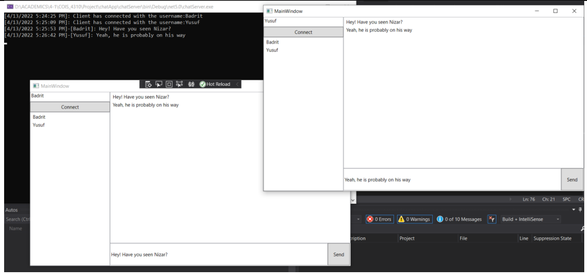

# Messaging App C#

Messaging app created with C#. Front End is made with Windows Forms. All messages are encrypted by the server and decrypted at the client side.

# Installation
You will need visual studio to run this project. [Download it from here](https://visualstudio.microsoft.com/downloads/)

# Usage
Open up ChatApp.sln and make sure "Multiple Startup Projects" is selected beside the start button. A terminal window and a windows form will show up. Users can connect themselves through the windows forms window that pops up. This is how it should look

# Contributions
[Yusuf Ghodiwala](https://github.com/Yusufghodiwala990)
